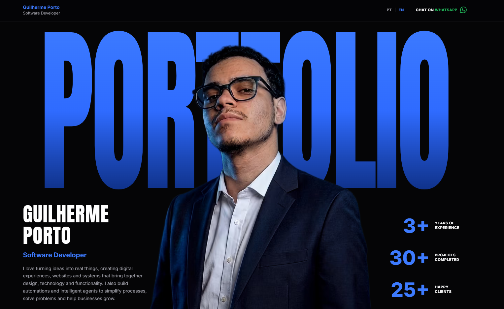

# Portfólio — Guilherme Porto



Site de portfólio pessoal de **Guilherme Porto** (Software Developer), construído fielmente a partir de protótipo criado no Figma. Landing page dark de página única com hero tipográfico, projetos, serviços, processo de trabalho, experiências, depoimentos e contato.

**Produção:** [guilherme-porto.dev.br](https://guilherme-porto.dev.br/)

## Stack

- [React 18](https://react.dev/) + [TypeScript](https://www.typescriptlang.org/)
- [Vite 6](https://vite.dev/) (build e dev server)
- [Tailwind CSS v4](https://tailwindcss.com/) (via `@tailwindcss/vite`)
- [lucide-react](https://lucide.dev/) (ícones)
- Fontes self-hosted via [Fontsource](https://fontsource.org/) (Anton + Inter Variable)
- [sharp](https://sharp.pixelplumbing.com/) (geração de imagens AVIF/WebP, dev only)

## Destaques

### Bilíngue (PT-BR / EN)
- Troca de idioma pelo botão **PT | EN** no header, sem bibliotecas de i18n — Context próprio em `src/i18n/LanguageContext.tsx` com dicionários tipados em `src/data/content.ts`.
- Cada idioma tem URL própria: `/` (PT-BR) e `/en` (EN), ligadas por `hreflang`.
- Primeira visita: detecta o idioma do navegador. Escolha manual fica salva no `localStorage` e prevalece nas próximas visitas. Voltar/avançar do navegador respeitado (`popstate`).
- `<html lang>`, `<title>`, meta description e canonical atualizam junto com o idioma.

### SEO
- Meta tags otimizadas para o nicho (desenvolvedor web, criação de sites, web design, sistemas web, automação, agentes de IA), Open Graph e Twitter Card.
- Dados estruturados JSON-LD (`Person` + `ProfessionalService`).
- `robots.txt` e `sitemap.xml` (com alternates de idioma) em `public/`.
- H1 com texto rico para buscadores (visualmente é a palavra "PORTFOLIO").

### Performance (Lighthouse 99–100 / SEO 100)
- Foto do hero servida em **AVIF/WebP** com `srcset` responsivo e fallback PNG (669KB → 26KB), `preload` no HTML e `fetchpriority="high"` (LCP protegido).
- Fontes self-hosted (sem requests ao Google Fonts na cadeia crítica).
- Animações 100% CSS (`opacity`/`transform`, GPU) disparadas por IntersectionObserver leve (`src/components/Reveal.tsx`), com `prefers-reduced-motion` respeitado. CLS 0.

## Rodando o projeto

```bash
npm install
npm run dev        # dev server em http://localhost:5173
```

### Scripts

| Script | Descrição |
|---|---|
| `npm run dev` | Dev server com HMR |
| `npm run build` | Typecheck (`tsc`) + build de produção em `dist/` |
| `npm run preview` | Serve o build de produção em http://localhost:4173 |
| `npm run optimize:images` | Regenera AVIF/WebP da foto do hero (rodar após trocar `public/foto-perfil.png`) |

> **Dica:** meça Lighthouse sempre no `preview`/produção — o dev server serve código sem minificar e distorce completamente o score.

## Estrutura

```
├── index.html                  # Meta tags, SEO, JSON-LD, preload do LCP
├── public/                     # foto-perfil (png/webp/avif), robots.txt, sitemap.xml
├── scripts/optimize-images.mjs # Gera variantes AVIF/WebP com sharp
└── src/
    ├── App.tsx                 # Composição das seções
    ├── index.css               # Tokens de tema (@theme), animações, fontes
    ├── data/content.ts         # TODO o conteúdo do site nos 2 idiomas + links
    ├── i18n/LanguageContext.tsx# Detecção, persistência e troca de idioma
    └── components/
        ├── Header.tsx          # Logo, switcher PT/EN, CTA WhatsApp
        ├── Hero.tsx            # PORTFOLIO gigante + foto + stats
        ├── Projects.tsx        # Projetos selecionados (placeholders)
        ├── Services.tsx        # 6 serviços
        ├── Process.tsx         # Timeline de 5 passos
        ├── Feedback.tsx        # Depoimentos
        ├── Experience.tsx      # Experiência profissional e certificações
        ├── Footer.tsx          # Contato e redes sociais
        ├── Reveal.tsx          # Wrapper de animação on-scroll
        └── BrandIcons.tsx      # SVGs de WhatsApp e TikTok
```

## Editando o conteúdo

Todos os textos, links, projetos, serviços e experiências ficam centralizados em **`src/data/content.ts`** (objetos `content.pt` e `content.en`). Para trocar um texto, adicionar um projeto real ou uma certificação, edite apenas esse arquivo — os componentes consomem os dados via `useLanguage()`.

## Deploy

1. `npm run build` → publique a pasta `dist/`.
2. O host precisa de **fallback de SPA** (servir `index.html` em `/en`) — padrão em Vercel, Netlify e Cloudflare Pages.
3. Após publicar em `guilherme-porto.dev.br`, cadastre o site no [Google Search Console](https://search.google.com/search-console) e envie o `sitemap.xml`.
